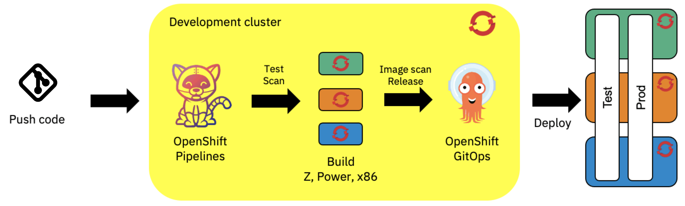

# OpenShift multiarchitecture build using Tekton - clusters setup

<!-- TODO Change the repo to the IBM org -->


This Terraform script is an automated setup for building multiarchitectures images using Tekton on different OpenShift clusters.

The pipelines used are under the repository : https://github.com/aminerachyd/ibm-garage-tekton-tasks/tree/multiarch-pipeline

The multiarchitecture pipelines build images for x86, IBM Z (s390x) and IBM Power (ppc64le) architectures.

## Prerequisites :

- Install [Terraform CLI](https://www.terraform.io/downloads.html)
- Admin access to two x86 clusters, a Z cluster and a Power cluster
- One x86 cluster is used as a "development cluster", the [Cloud-Native Toolkit](https://cloudnativetoolkit.dev/) should be installed on this cluster. The other clusters will be used as "workload clusters" to build images in the corresponding architectures.

## Customizable variables :

| Variable            | Description                                                                                                                                                                                                                                                                                                                                                                                                                               | Default value | Type   |
| ------------------- | ----------------------------------------------------------------------------------------------------------------------------------------------------------------------------------------------------------------------------------------------------------------------------------------------------------------------------------------------------------------------------------------------------------------------------------------- | ------------- | ------ |
| project_name        | Name of the project you want to create. The script will generate a project named `<project-name>-dev` on the development cluster in which you can run your pipelines. The script will create on each workload cluster 3 projects : `<project-name>-dev`, `<project-name>-test` and `<project-name>-prod`, the first for running a remote pipeline, and the other two for deploying the applications in test and production environments. | -             | string |
| dev-cluster-host    | API server for the development cluster. This cluster must be an x86 cluster with the Cloud-Native Toolkit installed.                                                                                                                                                                                                                                                                                                                      | -             | string |
| x86-cluster-host    | API server for the x86 workload cluster. This cluster will be used for running a remote pipeline.                                                                                                                                                                                                                                                                                                                                         | -             | string |
| power-cluster-host  | API server for the Power workload cluster. This cluster will be used for running a remote pipeline.                                                                                                                                                                                                                                                                                                                                       | -             | string |
| z-cluster-host      | API server for the Z workload cluster. This cluster will be used for running a remote pipeline.                                                                                                                                                                                                                                                                                                                                           | -             | string |
| dev-cluster-token   | Token for the development cluster. Access should be cluster admin.                                                                                                                                                                                                                                                                                                                                                                        | -             | string |
| x86-cluster-token   | Token for the x86 workload cluster. Access should be cluster admin.                                                                                                                                                                                                                                                                                                                                                                       | -             | string |
| power-cluster-token | Token for the power workload cluster. Access should be cluster admin.                                                                                                                                                                                                                                                                                                                                                                     | -             | string |
| z-cluster-token     | Token for the z workload cluster. Access should be cluster admin.                                                                                                                                                                                                                                                                                                                                                                         | -             | string |
| registry-user       | Username for the image registry to be used by the pipelines, will be stored in a secret `docker-registry-access` on all dev projects on all clusters.                                                                                                                                                                                                                                                                                     | -             | string |
| registry-token      | Access token for the image registry to be used by the pipelines, will be stored in a secret `docker-registry-access` on all dev projects on all clusters.                                                                                                                                                                                                                                                                                 | -             | string |

## Deploy with Terraform

1. Clone github repository

   ```bash
   git clone https://github.com/aminerachyd/multiarch-build-clusters-setup
   ```

2. Create your `variables.tfvars` variables file

3. Deploy with terraform

   ```bash
   terraform init
   terraform plan
   terraform apply
   ```
